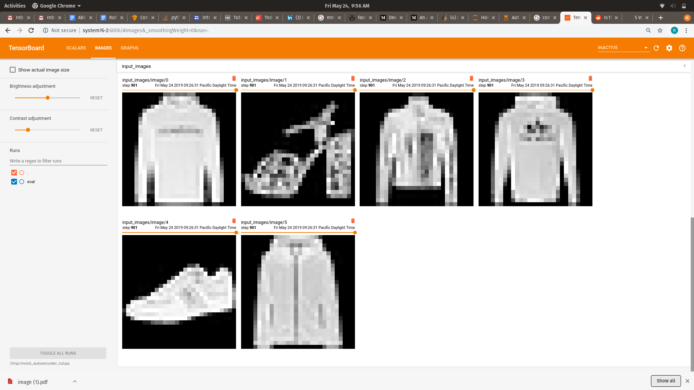
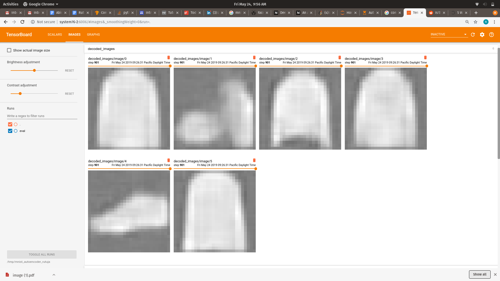
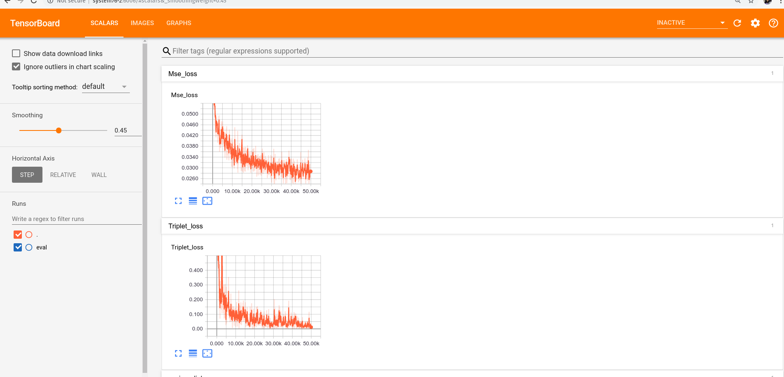

# MNIST reconstruction and similarity analysis through representation learning  

This work aims to analyze the intricacies of latent vectors and the information embedded in it .A feature learning task involves training models that are capable of inferring good representations from unlabelled data. Experimenting with different auto-encoderstrategies to learn representations from images. The models are evaluated considering both the reconstruction error of the
images and the similarity of feature spaces in terms of triplet loss .
The resulting latent vectors are clustered to gain an insight to embedding size and generalizability of the features learnt.

Sample of  original fashion MNIST images 

Sample Reconstruction fashion MNIST images 

Now the triplet loss wants to reduce the distance between similar looking images while the Reconstruction loss wants to make sure that input and output images are as identical as possible . So on one hand we want to find the categories which are similar but can also be reconstructed perfectly .
The training loss curves. 

